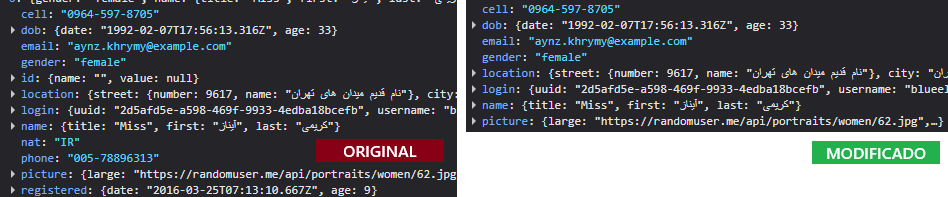

# ⚡ Porter Dash — Painel Administrativo de Usuários e Favoritos

> Projeto desenvolvido como parte de um **Desafio Técnico de Frontend Sênior**, utilizando **React e Next.js 15**, **Material UI**, **React Query** e **TypeScript**.

> O Projeto pode ser acessado tanto como **React** como **Next**, ambos estão documentados de como serem reproduzidos.

---

## 🧱 Sumário
- [Descrição](#descrição)
- [Arquitetura e Decisões Técnicas](#arquitetura-e-decisões-técnicas)
- [Autor](#autor)

---

## 🧩 Descrição

O **Porter Dash** é uma aplicação web que lista e gerencia usuários favoritos consumindo dados da **Random User API**.

Funcionalidades principais:
- Listagem paginada na tela de usuários;
- Exibição de dados principais: **foto**, **nome**, **e-mail** e **nacionalidade**;
- Tela de **detalhamento do usuário** com informações adicionais (telefone, gênero, país, idade);
- **Favoritar / desfavoritar** usuários com persistência local (`localStorage`);
- **Tela exclusiva** de usuários favoritos com scroll infinito;
- **Filtros por nome** na tela de favoritos e **por favoritos** e **nacionalidade** na tela de usuárops;
- **Feedback visual** (loading, mensagens e ícones);
- **Internacionalização** (português e inglês via `next-intl` e `i18n`).

---

## 🧠 Arquitetura e Decisões Técnicas

### 🧩 Framework e Estrutura
- Utilizado no app-next **Next.js (App Router)** pela estrutura moderna, otimização e suporte nativo a Server/Client Components e separação entre **Server Components** (metadados, SSR) e **Client Components** (componentes interativos com hooks)
- Utilizado no react-app **React 18 com Vite** que oferece inicialização e recarga rápida, eliminando tempo de espera e gerando builds otimizados.

### ⚙️ State Management
- Utilizado **React Query (`@tanstack/react-query`)** para gerenciamento de cache e estado assíncrono.
  - Justificativa: facilita o controle de *loading*, *error*, *refetch* e *caching* de requisições.
- Estados locais simples (como busca e favoritos) são tratados via **hooks customizados** com `useState` e `useLocalStorage`.

### 🧱 UI e Design System
- Baseado em **Material UI v7**, com customização leve via tema e `sx` props.
- CSS-in-JS nativo do MUI (`@emotion/styled`).

### 🌍 Internacionalização (i18n)
- Implementada com **next-intl** e **i18n**.
- Estrutura de mensagens no app-next em`messages/en.json` e `messages/pt.json` e no app-react em `locales/{lang}/common.js`.

### 🌍 Escolha da API
- A API utilizadada foi a **randomuser** devido a sua grande quantidade de dados e disponibilidade, podendo fazer requisição até de 1000 usuários, nela podemos obter diversas informações do usuário e realizar vários filtros para sua utilização.
- **Alerta** Ela possui uma limitação para fazer filtros de um único usuário então precisou ser adaptada, mesmo passando o parâmetro na consulta é feito um filtro dos usuários que estão em cachê para retornar o usuário com o mesmo UUID da rota, assim como é feito quando a API possui filtro.
- Toda a estrutura de tipagem dela pode ser conferida em `src/api/users/users.types.ts` .


### 🧭 Organização
- **Atomic Design** adaptado:
  - **Atoms:** botões, cards, inputs, skeletons.
  - **Molecules:** menus.
  - **Organisms:** tabelas completas, layouts, header, sidebar.
  - **Features:** páginas e funcionalidades especificas para cada página (Users, Favorites, etc).
  - **Template:** estrutura geral (sidebar + header).
- Requisições encapsuladas em `src/api/`.

### ⚛️ Utilização do GraphQL (Exclusivo aplicação React) 
- No projeto foi utilizando GraphQL com Apollo Client para adaptar a chamada da API na tela de detalhes do usuário, os dados foram manipulados para trazer apenas o necessário para renderização de informações na tela, abaixo é possível ver a diferença entre os retornos da requisição original e modificada.
  - Rota da tela na aplicação: **/user/{id}**




### 🧪 Testes (Exclusivo aplicação React) 
- O projeto utiliza Vitest para testes unitários e de hooks, com suporte ao React Testing Library.
A stack de testes foi configurada para permitir testes de hooks como useFavorites, componentes isolados e helpers da aplicação.
- Atualmente foram desenvolvidos testes para 2 arquivos:
  - **useFavorites**: Hook utilizado para adicionar e remover favoritos.
  - **Sidebar**: Componente onde são identificados os Menus e possui função de navegação.
- Para rodar os testes é necessário fazer a instalação do projeto e rodar o comando **npm run test**

---

## ⚙️ Setup do Projeto

### Pré-requisitos
- Node.js >= 20
- npm >= 9

### Instalação e Acesso Next

```bash
# Clonar o repositório
git clone https://github.com/RenatoAlbuquerque/porter-tec.git

# Acessar o diretório
cd app-next

# Instalar dependências
npm install

# Rodar o Projeto
npm build
npm start

#A aplicação estará disponível em http://localhost:3000
```

### Instalação e Acesso React

```bash
# Clonar o repositório
git clone https://github.com/RenatoAlbuquerque/porter-tec.git

# Acessar o diretório
cd app-react

# Instalar dependências
npm install

# Rodar o Projeto
npm run build
npm run preview

#A aplicação estará disponível em http://localhost:5173/
```

### Acesso aos projetos via Docker-compose

```bash
# Clonar o repositório
git clone https://github.com/RenatoAlbuquerque/porter-tec.git

# Rodar o commando no CMD
docker compose up --build

#A aplicação estará disponível em http://localhost:5173/ (React) e http://localhost:3000/ (Next)
```

### 👨‍💻 Autor

Renato Albuquerque
github.com/RenatoAlbuquerque

Frontend Developer | React, TypeScript, Next.js, MUI
